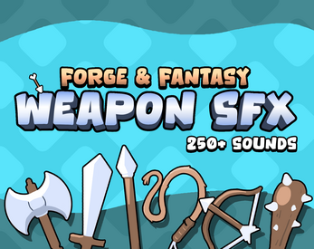

# Forge & Fantasy - 奇幻武器战斗音效包

一套高质量的奇幻 / RPG 武器与战斗音效资源，适用于游戏开发、动画、视频以及各类互动项目。

## 试听

[点击试听 Weapon SFX Preview](./Preview.wav)

## 价格

**9.9 元**

## 资源介绍

- 250+ 个武器与战斗类音效
- 提供 WAV / OGG 格式
- 24-bit / 48 kHz 高质量音频
- 多数音效包含多个不同变化版本
- 适用于 Roblox Studio、Unity、Unreal Engine、Godot、GameMaker 等游戏引擎

## 音效内容

### 武器类

- 长剑
- 短剑
- 武士刀
- 匕首
- 战斧
- 棍棒
- 链锤
- 长矛
- 骑枪
- 弓
- 十字弩
- 弹弓
- 飞刀
- 手里剑
- 回旋镖
- 鞭子
- 链鞭
- 拳击挥动
- 火把挥动

### 战斗命中类

- 轻型命中
- 强力命中
- 重型命中
- 钝击
- 肉体命中
- 厚重 / 爽感打击
- 箭矢击中木材
- 箭矢击中金属

### 其他音效

- 武器拔出
- 武器收回
- 铁砧敲击
- 武器碰撞
- 多种武器挥动变化

## 适合制作

适用于：

- RPG / ARPG
- 动作游戏
- 冒险游戏
- 地牢游戏
- 生存游戏
- 塔防游戏
- 格斗游戏
- Roblox 游戏
- 独立游戏

常见用途包括：

- 武器攻击
- 普通攻击
- 暴击
- 技能攻击
- 怪物受击
- Boss 战斗
- 投射物攻击
- 武器切换
- 战斗特效配音

## 音频规格

| 项目 | 规格 |
|---|---|
| 音效数量 | 250+ |
| 格式 | WAV / OGG |
| 音质 | 24-bit / 48 kHz |
| 类型 | 奇幻 / RPG / 战斗 / 武器 |
| 价格 | 9.9 元 |
